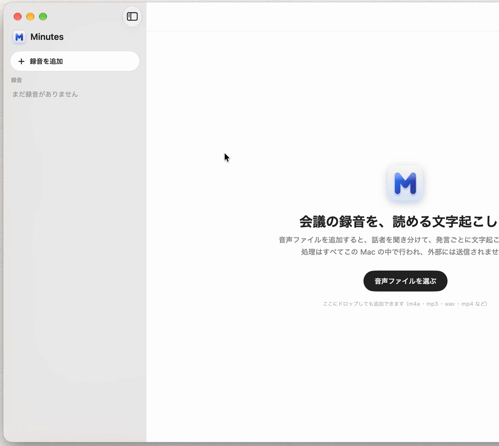
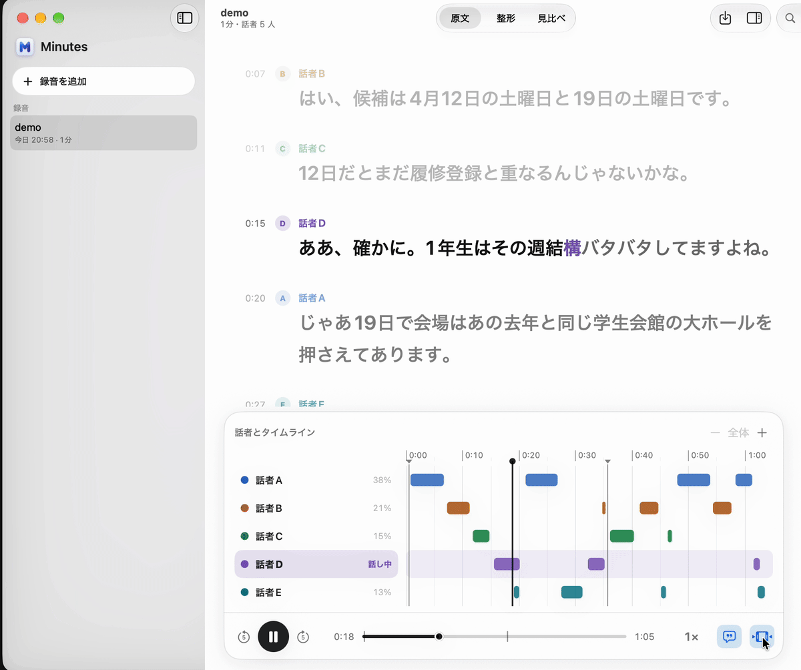
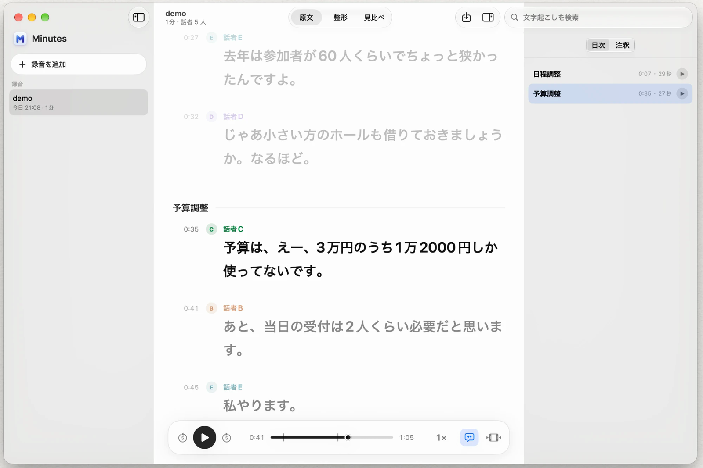
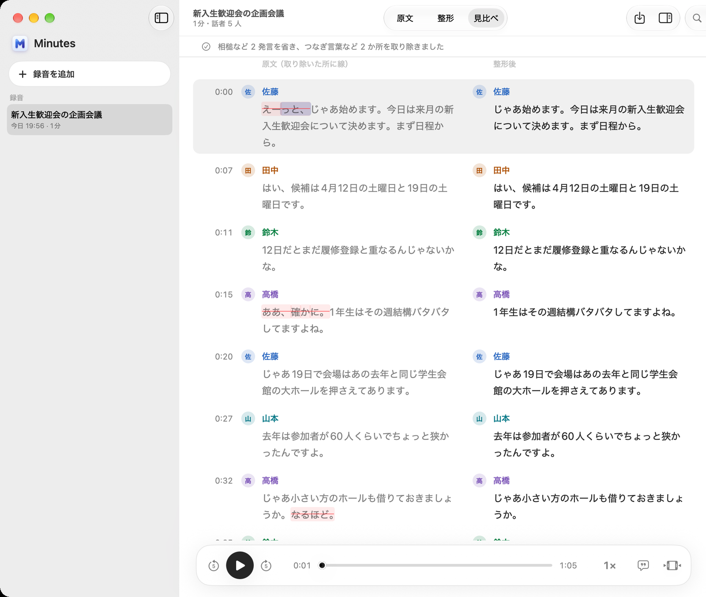

<h1 align="center">Minutes</h1>

<p align="center">
  会議の録音から、話者分離済みの文字起こしを作る Mac アプリ。処理はすべて Mac の中で完結する。
</p>

<p align="center">
  
</p>

---

## 目次

- [機能](#機能)
- [動かし方](#動かし方)
  - [動作環境](#動作環境)
  - [ビルドと実行](#ビルドと実行)
  - [CLI で使う](#cli-で使う)
- [仕組み](#仕組み)
  - [処理パイプライン](#処理パイプライン)
  - [モデル](#モデル)
- [コア機能の設計比較](#コア機能の設計比較)
  - [話者の割り当て](#話者の割り当て)
  - [方式選定の背景と試行錯誤](#方式選定の背景と試行錯誤)
  - [文字起こしモデル](#文字起こしモデル)
  - [まだ測っていないこと](#まだ測っていないこと)
- [コードの構成](#コードの構成)
- [ライセンス](#ライセンス)

---

## 機能

- 話者分離済み文字起こしの作成: 話者分離 → 音声を無音区間で区切りながら文字起こし → 文単位で話者の割り当て を順に進める
- 発言の整形: Gemma 4 E2Bを使い、つなぎ言葉（えー・あの など）と言い直しだけを消去。
- 注釈とエクスポート: ハイライト・コメント・ブックマーク・見出し（目次）などを文字起こしに付加できる

話者の割り当て方式の詳細とモデルの比較選定については [コア機能の設計比較](#コア機能の設計比較) を参照。  
議事録作成に関わるコア機能の設計・検証以外の、SwiftによるアプリおよびCLIの実装はClaude Codeで作成。

|             再生とタイムライン             |      見出しと目次・没入モード       |  整形の見比べ（つなぎ言葉を除去）   |
| :----------------------------------------: | :---------------------------------: | :---------------------------------: |
|  |  |  |

---

## 動かし方

### 動作環境

- Apple Silicon の Mac（macOS 15 以降）
- メモリ 8GB 以上（文字起こし中は最大 約 2.4GB を使用。精度優先の large-v3 を選ぶと約 3.9GB）
- 初回にモデル（合計 約 4.5GB）を Hugging Face からダウンロード（精度優先の large-v3 を選ぶと、さらに約 3.1GB）

### ビルドと実行

```bash
scripts/build-app.sh      # Release 版を作って build/Minutes.app に置く（約 40MB）
open build/Minutes.app
```

初回の起動時にモデルのダウンロード画面が表示される。  
※ `build-app.sh` は手元で動かすためのアドホック署名を行う。

### CLI で使う

アプリと同じ処理を、画面なしで動かせる。モデルは Hugging Face の標準キャッシュ（`~/.cache/huggingface/hub`）を使い、無ければ取得する。手元でビルドしたものは署名なしで動く。

```bash
scripts/build-cli.sh                                   # build/cli/ に diarize・transcribe・tidy を作成

build/cli/diarize meeting.m4a --out diarization.json   # 話者分離だけ（話者ごとの発話確率と発話区間）
build/cli/transcribe meeting.m4a --out transcript.json # 話者分離 → 文字起こし → 話者の割り当て（アプリと同じ結果。--model large で large-v3）
build/cli/tidy transcript.json                         # 発言の整形（消した所を ⟦ ⟧ で囲んで表示）

jq -r '.segments[] | "\(.start)s \(.speaker): \(.text)"' transcript.json   # 発言を 1 行ずつ出力
```

`transcript.json` の発言（`segments`）には、話者を決めた根拠として、話者ごとの平均発話確率（`prob_by_speaker`）と、時間の重なりだけで決めた場合の話者（`speaker_by_overlap`。WhisperX と同じ決め方）も記録される。

#### 簡易ビューア（tools/viewer.html）

`tools/viewer.html` をブラウザーで開き、`transcript.json` と音声ファイルを選ぶと、発言の一覧・話者ごとの発話区間・根拠を閲覧できる。  
発言をクリックするとその位置から再生し、時間の重なりだけで決めると話者が変わる発言に印が付く。ファイルはブラウザー内でのみ読み込まれ、外部へ送信されることはない。

---

## 仕組み

### 処理パイプライン

```
録音
 ├─▶ 音声の読み込み（AVFoundation、16 kHz モノラル）
 ├─▶ 話者分離: Nemotron-3-Diarization で、80ms ごとに最大 8 話者の発話確率を出力
 ├─▶ 区切り: 全員の発話確率が 0.5 未満の状態が 0.4 秒以上続く所（無音）の中央で区切る
 │     ※ 区切りは 5 → 10 → 20 → 40 → 60 秒と徐々に長くし、最初の発言が表示されるまでの時間を短縮
 ├─▶ 文字起こし: Whisper large-v3-turbo で区切りごとに、語ごとの時刻付きでテキスト化
 ├─▶ 話者の割り当て: Whisper の文字起こし区間ごとに、区間内の発話確率の合計が最大の話者を特定
 └─▶ 発言: 話者の交代・文末・長い無音で区切り、完了した区切りから順次画面に追加
```

- **先行話者分離**: 話者分離を先に丸ごと実行（数秒で完了し無音位置が判明）。そのバックグラウンドで Whisper を読み込む
- **ハルシネーション対策（繰り返し抑制）**: 笑い声などで Whisper が同じ文字を出力し続けた場合（「wwww…」など）、同じ文字が 10 文字連続した地点でカット
- **無音区間のスキップ**: 話者分離で全員の発話確率が 0.2 未満の区間は文字起こしに回さない（Whisper が無音区間でハルシネーションを起こしやすいため）

### モデル

初回起動時に Hugging Face から自動取得する（`MinutesKit/Sources/ModelStore`）。

| 用途                     | モデル                                                                                                    | ライセンス  | 備考                                                                                                |
| :----------------------- | :-------------------------------------------------------------------------------------------------------- | :---------- | :-------------------------------------------------------------------------------------------------- |
| **話者分離**             | [altic-dev/nemotron-3-diarization-coreml](https://huggingface.co/altic-dev/nemotron-3-diarization-coreml) | OpenMDW-1.1 | [nvidia/Nemotron-3-Diarization](https://huggingface.co/nvidia/Nemotron-3-Diarization) の Core ML 版 |
| **文字起こし**           | [openai/whisper-large-v3-turbo](https://huggingface.co/openai/whisper-large-v3-turbo)                     | Apache-2.0  | 既定モデル。読み込み時に MLX 形式へ変換                                                             |
| **文字起こし（高精度）** | [openai/whisper-large-v3](https://huggingface.co/openai/whisper-large-v3)                                 | Apache-2.0  | 設定画面で選択可能                                                                                  |
| **発言の整形**           | [mlx-community/Gemma4-E2B-IT-Text-int4](https://huggingface.co/mlx-community/Gemma4-E2B-IT-Text-int4)     | Apache-2.0  | フィラー除去・言い直し整形用                                                                        |

---

## コア機能の設計比較

それぞれの手法について、精度面・速度面における定性的な比較を行い、最終的に Whisper（既定は large-v3-turbo、設定で large-v3）+ Nemotron-3 Diarization を用いることにした。記載の数値は、多人数（話者分離の上限である 8 人を検出）による 12 分の日本語会話録音を、M1 MacBook Air で処理して計測した結果である。

### 話者の割り当て

文字起こし（Whisper）と話者分離は別のモデルで動作するため、タイムスタンプの切れ目が完全には一致しない。Whisper の 1 文ごとに誰の発言かを正しく紐付けることが議事録の可読性を大きく左右するが、話者の交代前後や複数人が同時に話す区間で取り違えが起きやすい。

最初は話者分離に pyannote を使ったが、区間の切り方が不正確で、区間と文の時間の重なりだけで話者を判定すると取り違えが多かった。そこで、時間区間に加えて声質でも照合する「方式B（声紋照合）」を開発した。その後 Nemotron-3 を導入したところ、区間の検出精度そのものが劇的に向上し、最終的には発話確率を合算するシンプルな計算（方式C）で十分な精度が得られるようになった。

| 方式                             | 1 文の話者の決め方                                                                          | 話者分離モデル                                                                         | 検証結果                                                                                                |
| :------------------------------- | :------------------------------------------------------------------------------------------ | :------------------------------------------------------------------------------------- | :------------------------------------------------------------------------------------------------------ |
| **A1 重なりの長さ**              | 重なった時間の長さが最も大きい話者（[WhisperX](https://github.com/m-bain/whisperX) と同様） | [pyannote 3.1](https://huggingface.co/pyannote/speaker-diarization-3.1) (2023)         | 区間の切り方の不正確さがそのまま影響し、取り違えが目立った                                              |
| **A2 重なりの割合**              | 話者の区間のうち、文と重なっている割合が最も大きい話者                                      | pyannote 3.1 (2023)                                                                    | 文の中にすっぽり入る短い区間（相槌など）の割合が 1.0 になり過大評価される                               |
| **B 声紋の照合**                 | 時間が重なる話者を候補にし、文の声紋が代表声紋に最も近い話者（自作方式）                    | pyannote (2023)<br>＋ [Resemblyzer](https://github.com/resemble-ai/Resemblyzer) (2019) | 当時は A1・A2 より取り違えが減少。ただし 1 秒未満の短発話では声紋が不安定で、代表声紋が歪む課題があった |
| **C 発話確率の合計<br>（採用）** | 80ms ごとの各話者の発話確率を文の区間で合計し、最大の話者                                   | **Nemotron-3-Diarization (2026)**                                                      | 区間検出精度が大幅に向上し、声紋を使わずに解決。モデル 1 つで高速処理（Core ML で 12 分が約 8 秒）      |

- **検証方法**: 文字起こし結果を固定し、話者の割り当てロジックのみを差し替え。自作の比較ビューアを用いて同じ再生位置で並べ、話者判定が食い違う区間を聞き比べて検証。
- **割り当て方式より話者分離モデルが効いていた**: Nemotron の区間を使う場合、割り当て計算の違いによる差は小さい。12 分の録音（110 発言）で、方式 C と違う話者になったのは、時間の長さ（A1 的）で決めると 2 発言、割合（A2 的）で決めると 15 発言だった（正解と比べた数字ではない）。精度を左右していたのは、割り当ての計算よりも、話者分離モデル自体の精度だったと考えている。

### 方式選定の背景と試行錯誤

以下は、Nemotron-3 に移行するまでに直面した課題と試行錯誤の過程である。

1. **時間重複アプローチ（A1・A2）の限界**
   - 会議では相手の発言中に「ええ」「はい」といった短い相槌が頻発する。
   - 例えば、文字起こし区間 `[10s - 20s]`（「ええ、それでですね、次の議題に…」）に対し、話者分離の区間が話者 A `[11s - 13s]`（相槌）、話者 B `[14s - 25s]`（本題）だった場合、A2（話者区間に占める重なりの割合）では A が 2÷2 = 1.0、B が 6÷11 ≒ 0.55 となり、10 秒の発言全体が相槌を打った話者 A に誤って割り当てられてしまう。
   - A1（時間の長さ）でも、pyannote の区間の端のズレによって誤判定が頻発した。

2. **声紋埋め込みベクトルによる話者判定（方式B）**
   - 相槌問題を回避するため、時間的に重なる話者を候補に絞った上で、音声区間から声紋ベクトル（Embedding）を抽出してコサイン類似度で照合する方式を自前で実装した。
   - 方式 A より取り違えが減少し、手元の音声で試した範囲では商用の議事録サービスと遜色ない印象だった。
   - しかし、**1 秒未満の短い発話区間では声紋特徴量が極めて不安定**であり、各話者の「代表声紋」がノイズで汚染され、結果として通常の発話まで誤認識する副作用が生じた（区間長に応じた重みづけを行っても限界があった）。また、話者分離と声紋抽出で 2 つのモデルを動かすため、ローカル推論の負荷が高いことも課題だった。

3. **最新モデル（Nemotron-3, 2026年）による根本解決（方式C）**
   - 2026年9月に NVIDIA から公開された Nemotron-3 Diarization を採用。0.1B と超軽量ながら、フレーム単位（80ms）で各話者の発話確率を直接出力できる。
   - Whisper の文区間全体でこの発話確率を合算（積分）する方式としたことで、声紋抽出という不安定な中間ステップを挟まず、相槌が重なっていても文全体で優勢な話者が確率的に自然と選ばれるようになった。
   - ※単語単位での割り当ては Whisper の単語タイムスタンプの揺らぎに弱かったため、文（セグメント）単位で集計している。

### 文字起こしモデル

MLX 向けモデルを比較。新しい Qwen3-ASR は公開ベンチマークの成績が良いとされるが、日本語音声で検証したところ Whisper 系の出力が文章として安定していたため、Whisper を採用した。

精度と速度には明確なトレードオフがあるため、既定は待ち時間の短い turbo にし、設定で精度優先の large-v3 を選べるようにしている。アプリでの実測（12 分の録音）では、turbo が 76 秒・最初の発言まで 2.9 秒・メモリ最大 2.4GB に対し、large-v3 は約 4 分・メモリ最大 3.9GB だった。

| モデル                                                                             | 発表年 | 12 分の処理時間 | 特徴と所見                                                                                                                                                              |
| :--------------------------------------------------------------------------------- | :----: | :-------------: | :---------------------------------------------------------------------------------------------------------------------------------------------------------------------- |
| **Whisper large-v3**<br>（mlx-whisper, GPU）                                       |  2023  |     249 秒      | **精度優先（設定で選択可能）**。<br>文単位で自然に区切られて出力されるため、議事録として読みやすい。認識精度も極めて高い。                                              |
| **[Whisper large-v3-turbo](https://huggingface.co/openai/whisper-large-v3-turbo)** |  2024  |      76 秒      | **既定モデル**。<br>large-v3 の約 1/3 の処理時間、メモリ 2.4GB（large-v3 は 3.9GB）。一方、意味の変わる聞き違いやハルシネーションが large-v3 より多く発生する傾向あり。 |
| **[Whisper medium](https://huggingface.co/openai/whisper-medium)**                 |  2022  |        —        | large-v3 との体感差は小さかったが、より高速な turbo を既定にしたため不採用。                                                                                                                             |
| **[Qwen3-ASR-1.7B](https://huggingface.co/Qwen/Qwen3-ASR-1.7B)**（MLX）            |  2026  |     266 秒      | 1 音ごとの聞き取りは正確だが、文区切りのない語単位出力となるため、文として連結した際に Whisper と比べて可読性が劣った。                                                 |

### まだ測っていないこと

- 正解の書き起こし（話者付き）と突き合わせた、文字誤り率（CER）および文字単位の話者誤り率の定量測定（方式BとCの同一データでの比較）
- 会議データ（2人の対話、3〜4人の多人数会議など）のサンプル拡充と、商用サービスとの同条件比較
- 画面初期表示を早めるための最初の短い区切り（5秒）において、Whisperの認識精度が低下していないかの検証
- 特定の専門用語や人名が多く出てくる会話において、Whisperのプロンプト機能がどこまで対応できるかの確認

---

## コードの構成

| パス                                           | 内容                                                                                                                                                   |
| :--------------------------------------------- | :----------------------------------------------------------------------------------------------------------------------------------------------------- |
| `Minutes/`                                     | SwiftUI アプリ。<br>・`Model/`: 録音一覧・処理キュー・再生・整形・モデル取得<br>・`Views/`: 画面 UI<br>・`Debug.swift`: 開発用（画面出力・軽量化計測） |
| `MinutesKit/`                                  | コア処理の Swift パッケージ                                                                                                                            |
| `MinutesKit/Sources/Diarization`               | 話者分離。ネットワーク推論のみ Core ML で動かし、特徴量抽出・チャンク分割・話者キャッシュ更新は NeMo と同様の計算を Swift で実行                       |
| `MinutesKit/Sources/Transcription`             | 文字起こし。[mlx_whisper](https://github.com/ml-explore/mlx-examples/tree/main/whisper) の Swift 移植（モデル・デコード・単語タイムスタンプ）          |
| `MinutesKit/Sources/MinutesCore`               | パイプライン制御（区切り・話者割り当て・発言分割）とデータモデル                                                                                       |
| `MinutesKit/Sources/Tidying`                   | Gemma 4 E2B による発言の整形（フィラー除去）                                                                                                           |
| `MinutesKit/Sources/ModelStore`                | Hugging Face からのモデルダウンロード・管理                                                                                                            |
| `MinutesKit/Sources/{diarize,transcribe,tidy}` | コア機能の各 CLI 実装                                                                                                                                  |
| `scripts/build-app.sh`                         | アプリ Release 版のビルドスクリプト                                                                                                                    |
| `scripts/build-cli.sh`                         | CLI のビルドスクリプト                                                                                                                                 |
| `tools/viewer.html`                            | CLI の実行結果を可視化・再生確認できるブラウザビューア                                                                                                 |
| `tools/app-icon.svg`                           | アプリのアイコン元データ                                                                                                                               |
| `images/`                                      | ドキュメント用画像・GIF                                                                                                                                |

> 録音データおよびモデルは App Sandbox 内（`Application Support`）に保存される。ネットワーク通信はモデルの初回ダウンロード時のみ使用される。

---

## ライセンス

MIT（[LICENSE](LICENSE)）。  
移植コードのライセンス詳細は [THIRD_PARTY_NOTICES.md](THIRD_PARTY_NOTICES.md)、各モデルのライセンスは [モデル一覧](#モデル) を参照。
